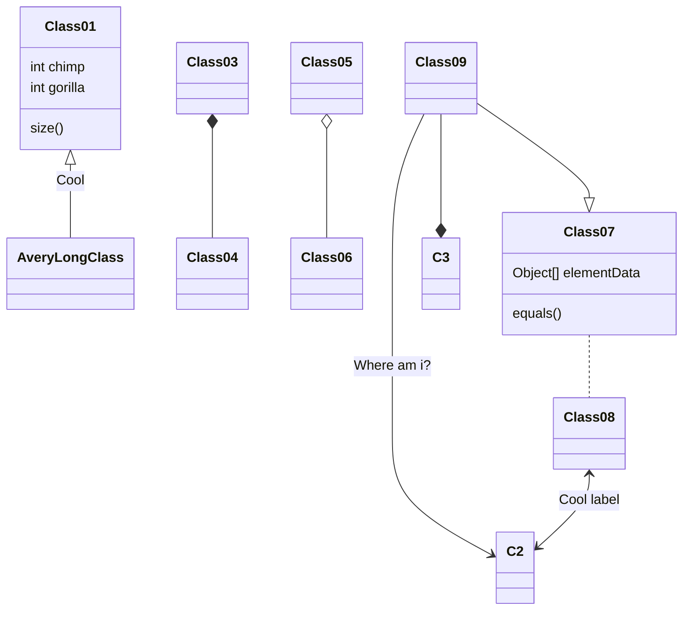

# Trinat_Coulomb_Hangman
### Hangman Game for a study project
Studyproject created by Anderrüti Julien, Gasser Simon, Krucker Benjamin and Richard Wadsworth

### Einleitung
Im Rahmen einer Projektarbeit möchten wir hiermit eine Spielsoftware vorstellen, welche wir anhand von Software-Engeneering Methoden im Team realisiert haben. Ziel des Projekts war es Methoden wie Scrum oder Agiles praktisch anzuwenden und somit alle wichtige Phase beim strukturierten Erstellen von Software zu durchlaufen.
Zu diesem Zweck erstellten wir ein Spiel allgemein bekannt als Hangman welches in unserer Fassung von zwei oder einem Spieler gespielt werden kann. Ziel des Spiels ist es ein vorgegebenes Wort (Suchbegriff), mit einer beliebigen Anzahl an Buchstaben zu erraten, indem man auf verschiedene Buchstaben tippt. Wenn man das Wort erraten hat ohne eine bestimmte Anzahl falsche Tipps zu überschreiten hat man das Spiel gewonnen.

### Ziele
Wir wollen eine Software gestallten welche dem oder den Benutzern die Möglichkeit gibt Hang man zu Spielen.
Im "One Player"-Modus soll vom Spieler durch Knopfdruck ein Suchbegriff generiert werden. Der Suchbegriff stammt aus einer Datenbank mit einer bestimmten Anzahl an Worten. 

-2player-

Dem Spieler werden verschiedene Anzeigen angezeigt. Zum einen der Spielfortschritt zum anderen die Eingabemšglichkeiten. Der Spielfortschritt wird durch zwei Grafiken erkennbar gemacht. Zum einen wird die Anzahl und die gefunden Buchstaben des Suchbegriffs angezeigt. Zum anderen wird bei jedem eingegebenen Buchstaben, welcher nicht Bestanteil des Suchbegriffs ist, Strich für Strich ein Strichmännchen vervollständigt, welches an einem Galgen hängt. Die Eingabemöglichkeit besteht aus einer virtuellen Tastatur.

### Randbedingungen
Das Programm wird in der Programmiersprache Java erstellt.
Das Projektteam besteht aus vier Personen.
Zur Programmierung wird Eclipse verwendet.
Der Build wird durch Maven automatisiert.

## Build Anleitung

## Bedienungsanleitung

## Userstories mit Akzeptanzkriterien
inkl Storypoints

## TestCases

| Test Scenario ID      | TS001                                                                        | Test Case ID   | TC001 |
|-----------------------|------------------------------------------------------------------------------|----------------|-------|
| Test Case Description | Check if the Alphabet Class delivers all its expected values                 | Test Priority  | High  |
| Pre-Requisite         | The Class Alphabet with methods to deliver values depending on entered value | Post-Requisite | None   |

| Nr | Action                           | Input | Expected Output | Actual Output | IDE            | Test Result |
|----|----------------------------------|-------|-----------------|---------------|----------------|-------------|
| 1  | Return letter based on number    | 3     | 'D'             | 'D'           | Eclipse EE IDE | Passed      |
| 2  | Return number based on letter    | 'a'   | 0               | 0             | Eclipse EE IDE | Passed      |
| 3  | Caps-insensitivity of Test Nr 2  | 'A'   | 0               | 0             | Eclipse EE IDE | Passed      |

### Release Plan

### Userstories mit Akzeptanzkriterien
| US | Name                 |                                                                                                                                                                                                                                                                                                                                                | SP | Prio |
|----|----------------------|------------------------------------------------------------------------------------------------------------------------------------------------------------------------------------------------------------------------------------------------------------------------------------------------------------------------------------------------|----|------|
| 1  | Virtuelle Tastatur   |  Als "Spieler 2" moechte ich "virtuelle tasten betätigen können"um " dem Spiel einen Buchstaben vor zu schlagen". #AK: - Teste, ob im Spiel eine virtuelle tastatur angezeigt wird. - Teste, ob das Programm eine bzw. die richtige Eingabe entgegennimmt.                                                                                   | 5  | 1    |
| 2  | Physische Tastatur   |  Als Spieler 2 möchte ich "über die physischen tasten, Eingaben machen können" um " dem Spiel einen Buchstaben vor zu schlagen". #AK: - Teste, ob mit der Tastatur, Eingaben gemacht werden können die das Programm erkennt.                                                                                                                   | 3  | 5    |
| 3  | Spielinitialisierung |  Als Spieler 1 moechte ich " über die physische oder vituelle Tastatur ein Wort eingeben koennen" um " das Spiel zu beginnen". #AK: - Teste, ob sich über die physische tastatur ein Wort eingeben lässt um das Spiel zu initialisieren. - Teste, ob sich über die virtuelle Tastatur ein Wort eingeben lässt um das Spiel zu initialisieren.  | 3  | 1    |
|    |                      |                                                                                                                                                                                                                                                                                                                                                |    |      |
### Release Plan

-	Business value
inkl Ausbaustufen

## Dokumentation Sprint

